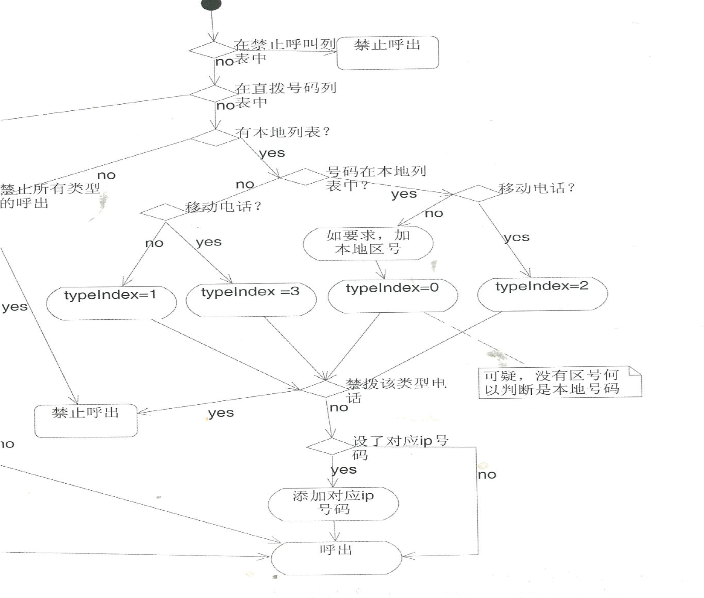

# background

Philips use the MML (some kind of table driven language) to describe the call logic,  it need thousands lines of code to describe the complicated logic as  

# my solution

embedding the c function into the MML engine, so the table is driven by the return value of c function.

after change, the  MML code is about 10 lines;  the  c code is about 100 lines, and is quite easy to maintain or to add new feature 

